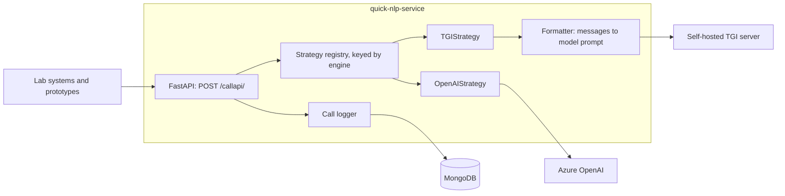
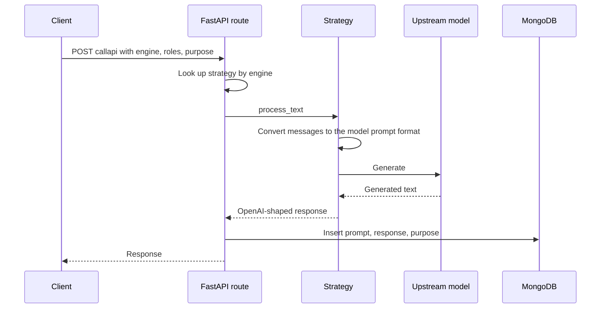

# quick-nlp-service

English | [繁體中文](README.zh-TW.md)

A small LLM gateway: one HTTP endpoint and one request format in front of Azure OpenAI and self-hosted open-source models, with every call logged for later analysis.

I built it in early 2024 for a university research lab. Several internal systems and prototypes needed LLM access at the same time, the models behind them kept changing, and there was no widely agreed-upon gateway solution to adopt yet. This service was the stopgap: a thin layer that let those systems connect to the resources the lab already had without each of them re-implementing the integration.

## The problem

- **Every system was integrating models on its own.** Each one needed the Azure OpenAI credentials, its own client code, and its own idea of what a request looked like.
- **Open-source models each expect a different prompt template.** Llama 2, Taiwan-LLaMa and Llama 3 all want the conversation serialized differently. Swapping the model meant touching every caller.
- **Nobody could see how the models were being used.** Calls were scattered across applications, so there was no single place to review prompts and responses afterwards.

## What it does

**One endpoint, routed by `engine`.** Callers send an OpenAI-style message list to `POST /callapi/`. The `engine` field selects a strategy from a registry; the caller never needs to know whether the model is a cloud API or a box in the lab.

| `engine` | Backend |
|---|---|
| `gpt-35-turbo`, `gpt-35-turbo-16k`, `gpt-35-turbo-instruct`, `gpt-4`, `gpt-4-32k` | Azure OpenAI |
| `taide-llama-3` | Self-hosted model behind HuggingFace Text Generation Inference (TGI) |

**A prompt-format translation layer.** Callers always speak the OpenAI `role` / `content` format. For models served through TGI's raw `/generate` API, a `Formatter` serializes the conversation into the template the model expects:

| Target | Serialization |
|---|---|
| Llama 2 | `[INST] ... [/INST]` turns with a `<<SYS>>` system block |
| Taiwan-LLaMa | `USER:` / `ASSISTANT:` turns |
| Llama 3 | `<\|start_header_id\|>` / `<\|eot_id\|>` header tokens |

The response is normalized the other way, into an OpenAI-shaped `choices[0].message`, so callers parse one shape regardless of backend.

**Call logging with a `purpose` tag.** Every request and response is written to MongoDB (model, prompt, choices, token usage when the backend reports it). Each call carries a free-form `purpose` string, so records from different systems or experiments can be separated later.

## Example

```bash
curl -X POST http://localhost/callapi/ \
  -H "Content-Type: application/json" \
  -d '{
    "engine": "taide-llama-3",
    "roles": [
      {"role": "system", "content": "You are a helpful assistant."},
      {"role": "user", "content": "Hello"}
    ],
    "temperature": 0.7,
    "max_tokens": 200,
    "frequency_penalty": null,
    "presence_penalty": null,
    "purpose": "demo"
  }'
```

Response shape for a TGI-backed engine (illustrative, written from the code rather than captured from a live run):

```json
{
  "model": "taide-llama-3",
  "choices": [
    { "message": { "role": "assistant", "content": "..." } }
  ]
}
```

For Azure OpenAI engines the upstream response is returned as-is. The full parameter list, including which parameters each backend ignores, is on the auto-generated Swagger page at `/docs`.

## Architecture





## Design decisions

- **Speak the OpenAI message format at the boundary.** The calling systems already produced `role` / `content` lists. Keeping that shape meant switching a caller from GPT to a self-hosted model was a one-field change.
- **Strategy pattern plus a plain dict registry.** Each backend is a class with a single `process_text(params)` method; the registry maps engine names to instances. Adding a backend is one new file and one registry line, and the route handler never changes.
- **Model serving moved out of the gateway.** The first version loaded models inside the container with `transformers`, which is why there are separate CPU and CUDA Dockerfiles selected by `COMPUTE_UNIT`. Ten days in, inference moved to an external TGI server and the gateway became a pure HTTP proxy. `torch` and `transformers` are gone from `requirements.txt`, and the gateway no longer needs a GPU.
- **Logging is in the request path, tagged by purpose.** A single shared entry point is the natural place to record usage, and the `purpose` field was the cheapest way to keep different consumers' records apart without building user management.

## How it was built

Designed and written by me. ChatGPT was used at the time as a sounding board for approaches; the design decisions and the code are my own.

The commit history shows the service following the lab's model choices over about three months:

| Date | Change |
|---|---|
| 2024-02-02 | Initial FastAPI service with the Azure OpenAI strategy; local Llama 2 strategy via `transformers`; CPU / CUDA Dockerfiles |
| 2024-02-12 | TGI strategy added; inference moves to an external server |
| 2024-02-22 to 02-27 | Served model switched from chinese-alpaca-2-7b to llama-2-7b |
| 2024-04-09 to 04-20 | Taiwan-LLaMa strategy and prompt template |
| 2024-04-24 to 04-29 | Llama 3 prompt template; engine becomes `taide-llama-3`; `transformers` dependency removed |

## Status

Retired. This was a deliberately temporary solution for a period when there was no consensus tooling for this problem. It did its job and is no longer maintained. Dependencies are pinned to their early-2024 versions (including the pre-1.0 `openai` SDK), and the local-inference strategy files remain in the tree as history but are not registered. For the same need today I would adopt an off-the-shelf gateway rather than maintain my own.

## Running it

Requires Docker with the compose plugin, Azure OpenAI credentials and/or a reachable TGI server.

```bash
cp .env.example .env    # then fill in the values
docker compose up --build
```

The API is served on port 80 of the host; Swagger UI is at `http://localhost/docs`.

| Variable | Purpose |
|---|---|
| `OPENAI_API_TYPE`, `OPENAI_API_KEY`, `OPENAI_API_ENDPOINT` | Azure OpenAI connection |
| `TGI_API_ENDPOINT` | `/generate` URL of the TGI server behind `taide-llama-3` |
| `TAIWAN_TGI_API_ENDPOINT` | `/generate` URL for the Taiwan-LLaMa strategy (not registered by default) |
| `MONGODB_HOST`, `MONGODB_DATABASE`, `MONGODB_COLLECTION` | Where call logs are written |
| `COMPUTE_UNIT` | `CPU` or `CUDA`; selects `Dockerfile.CPU` or `Dockerfile.CUDA` |
| `HF_ACCESS_TOKEN`, `MODEL_DIR` | Only used by the retired local-inference strategy |

### Adding a backend

1. Create a class in `app/nlp_service/strategies/` that subclasses `NLPInterface` and implements `process_text(params) -> Response`.
2. If the model needs its own prompt template, add a conversion method to `app/component/formatter.py`.
3. Register it under an engine name in `app/nlp_service/strategies/strategy_registry.py`.
