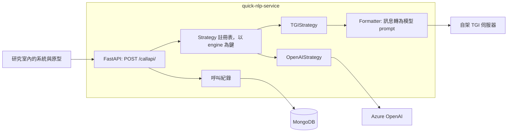
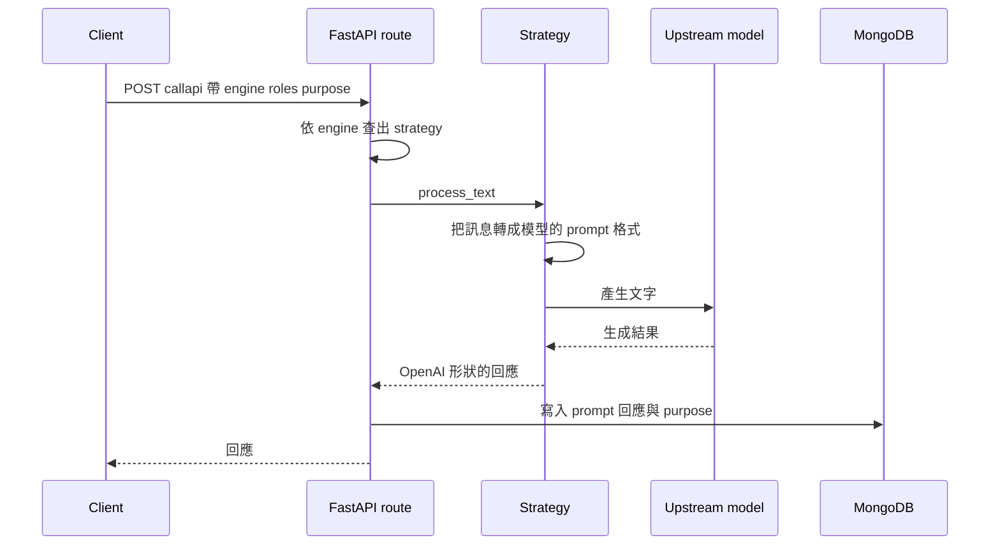

# quick-nlp-service

[English](README.md) | 繁體中文

一個輕量的 LLM 閘道：用同一個 HTTP 端點、同一種請求格式，接上 Azure OpenAI 與自架的開源模型，並把每一次呼叫記錄下來供事後分析。

這是我在 2024 年初為一間大學研究室做的。當時研究室裡有好幾個系統和原型同時需要用到 LLM，背後的模型又一直在換，而市場上還沒有一個大家有共識的閘道方案可以直接採用。這個服務就是那段期間的過渡方案：一層很薄的中介，讓各個系統能方便地連上研究室既有的資源，不必各自重做一次整合。

## 要解決的問題

- **每個系統都在各自串接模型。** 每個系統都要拿一份 Azure OpenAI 的金鑰、寫一份自己的 client、定義一套自己的請求格式。
- **每種開源模型要的 prompt 模板都不一樣。** Llama 2、Taiwan-LLaMa、Llama 3 對「一段對話該怎麼序列化」各有規定，換一次模型，所有呼叫端都得跟著改。
- **沒有人看得到模型實際上怎麼被使用。** 呼叫散落在各個應用程式裡，事後想回頭檢視 prompt 與回應，沒有一個統一的地方可查。

## 它做什麼

**單一端點，用 `engine` 分派。** 呼叫端把 OpenAI 風格的訊息列表送到 `POST /callapi/`，由 `engine` 欄位從註冊表中選出對應的 strategy。呼叫端不需要知道背後是雲端 API 還是研究室裡的一台機器。

| `engine` | 後端 |
|---|---|
| `gpt-35-turbo`、`gpt-35-turbo-16k`、`gpt-35-turbo-instruct`、`gpt-4`、`gpt-4-32k` | Azure OpenAI |
| `taide-llama-3` | 以 HuggingFace Text Generation Inference（TGI）服務的自架模型 |

**Prompt 格式轉換層。** 呼叫端一律使用 OpenAI 的 `role` / `content` 格式。對於透過 TGI 原生 `/generate` API 服務的模型，由 `Formatter` 把對話序列化成該模型要的模板：

| 目標模型 | 序列化方式 |
|---|---|
| Llama 2 | `[INST] ... [/INST]` 回合，加上 `<<SYS>>` 系統訊息區塊 |
| Taiwan-LLaMa | `USER:` / `ASSISTANT:` 回合 |
| Llama 3 | `<\|start_header_id\|>` / `<\|eot_id\|>` header token |

回應則反向正規化成 OpenAI 形狀的 `choices[0].message`，所以不論後端是誰，呼叫端只需要解析一種結構。

**呼叫紀錄與 `purpose` 標籤。** 每一次請求與回應都會寫入 MongoDB（模型、prompt、choices，以及後端有回報時的 token 用量）。每次呼叫都帶一個自由填寫的 `purpose` 字串，之後就能把不同系統或不同實驗的紀錄分開來看。

## 使用範例

```bash
curl -X POST http://localhost/callapi/ \
  -H "Content-Type: application/json" \
  -d '{
    "engine": "taide-llama-3",
    "roles": [
      {"role": "system", "content": "你是一個樂於助人的助理。"},
      {"role": "user", "content": "你好"}
    ],
    "temperature": 0.7,
    "max_tokens": 200,
    "frequency_penalty": null,
    "presence_penalty": null,
    "purpose": "demo"
  }'
```

TGI 後端的回應結構（示意：依程式碼撰寫，並非實際執行擷取的輸出）：

```json
{
  "model": "taide-llama-3",
  "choices": [
    { "message": { "role": "assistant", "content": "..." } }
  ]
}
```

Azure OpenAI 的 engine 則是原樣回傳上游的回應。完整的參數清單，以及各後端會忽略哪些參數，可以在自動產生的 Swagger 頁面 `/docs` 查看。

## 架構





## 技術決策

- **對外沿用 OpenAI 的訊息格式。** 呼叫端的系統原本就在產生 `role` / `content` 列表。維持這個形狀，呼叫端從 GPT 換到自架模型只需要改一個欄位。
- **Strategy 模式加上一個單純的 dict 註冊表。** 每個後端是一個只有 `process_text(params)` 方法的類別，註冊表把 engine 名稱對應到實例。新增後端只要加一個檔案、註冊表加一行，route handler 完全不用動。
- **把模型推論移出閘道。** 第一版是在容器裡用 `transformers` 直接載入模型，這也是為什麼會有 CPU 與 CUDA 兩份 Dockerfile、用 `COMPUTE_UNIT` 切換。十天後，推論改由外部的 TGI 伺服器負責，閘道變成單純的 HTTP 代理；`torch` 與 `transformers` 已從 `requirements.txt` 移除，閘道本身不再需要 GPU。
- **紀錄放在請求路徑上，並以 purpose 區分。** 既然所有呼叫都經過同一個入口，這裡就是記錄使用情況最自然的位置；而 `purpose` 欄位是在不做使用者管理的前提下，把不同使用方的紀錄分開的最低成本做法。

## 怎麼做出來的

設計與程式都是我自己完成的；當時 ChatGPT 只用來討論解題思路。

從 commit 歷史可以看到，這個服務在大約三個月內跟著研究室的模型選擇一路調整：

| 日期 | 變更 |
|---|---|
| 2024-02-02 | FastAPI 服務初版與 Azure OpenAI strategy；以 `transformers` 在本地推論的 Llama 2 strategy；CPU / CUDA Dockerfile |
| 2024-02-12 | 加入 TGI strategy，推論移到外部伺服器 |
| 2024-02-22 至 02-27 | 服務的模型由 chinese-alpaca-2-7b 換成 llama-2-7b |
| 2024-04-09 至 04-20 | Taiwan-LLaMa 的 strategy 與 prompt 模板 |
| 2024-04-24 至 04-29 | Llama 3 的 prompt 模板；engine 改為 `taide-llama-3`；移除 `transformers` 依賴 |

## 現況

已退役。這原本就是刻意定位成暫時性的方案，用來撐過這個問題還沒有共識工具的那段時間；它完成了任務，目前不再維護。依賴套件停留在 2024 年初的版本（包含 1.0 之前的 `openai` SDK），本地推論的 strategy 檔案仍留在專案中作為歷史，但沒有註冊。同樣的需求放到今天，我會直接採用現成的閘道方案，而不是自己維護一套。

## 如何執行

需要 Docker（含 compose plugin），以及 Azure OpenAI 的憑證和／或一台連得到的 TGI 伺服器。

```bash
cp .env.example .env    # 然後填入各項設定
docker compose up --build
```

API 會開在主機的 80 port，Swagger UI 在 `http://localhost/docs`。

| 變數 | 用途 |
|---|---|
| `OPENAI_API_TYPE`、`OPENAI_API_KEY`、`OPENAI_API_ENDPOINT` | Azure OpenAI 連線設定 |
| `TGI_API_ENDPOINT` | `taide-llama-3` 背後 TGI 伺服器的 `/generate` 網址 |
| `TAIWAN_TGI_API_ENDPOINT` | Taiwan-LLaMa strategy 使用的 `/generate` 網址（預設未註冊） |
| `MONGODB_HOST`、`MONGODB_DATABASE`、`MONGODB_COLLECTION` | 呼叫紀錄寫入的位置 |
| `COMPUTE_UNIT` | `CPU` 或 `CUDA`，決定使用 `Dockerfile.CPU` 或 `Dockerfile.CUDA` |
| `HF_ACCESS_TOKEN`、`MODEL_DIR` | 只有已退役的本地推論 strategy 會用到 |

### 新增一個後端

1. 在 `app/nlp_service/strategies/` 建立一個繼承 `NLPInterface` 的類別，實作 `process_text(params) -> Response`。
2. 如果模型需要自己的 prompt 模板，在 `app/component/formatter.py` 加一個轉換方法。
3. 在 `app/nlp_service/strategies/strategy_registry.py` 用一個 engine 名稱註冊它。
